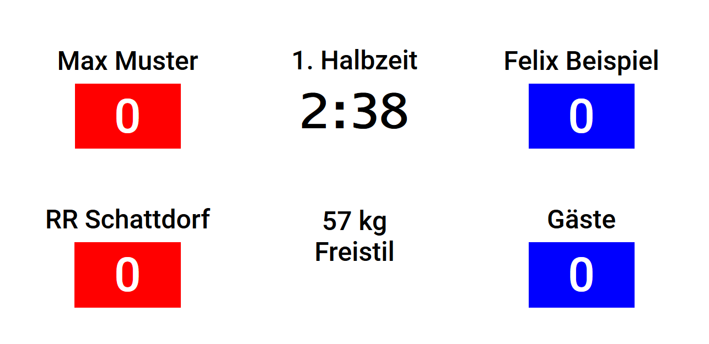

# RRS wrestling scoreboard

Digital Scoreboard to show time, weight category, names, points and cautions for an Olympic Wrestling match. The scoreboard can be used offline by opening index.html with a browser, controlling it with a keyboard. Matches with all wrestler names can be saved to and read from .json files (see example/beispielkampf.json).

The scoreboard was written in Typescript for [RR Schattdorf](http://www.rrschattdorf.ch/), hence the name, for matches in Swiss wrestling leagues. The interface is currently only available in German.
